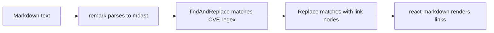

import { PropsTable } from '@/components/ui/props-table';

# Markdown

reachat uses [react-markdown](https://github.com/remarkjs/react-markdown) and
[remark](https://github.com/remarkjs/remark) to parse and render markdown.
By default, responses are rendered with GitHub-flavored markdown, math (KaTeX),
and YouTube embeds. Code blocks pass through `<CodeHighlighter>` for syntax
highlighting and a copy button.

You can extend the pipeline two ways:

- **`remarkPlugins`** — add or replace remark plugins on the `<Chat>` component
- **`markdownComponents`** — override how individual elements (`code`, `a`,
  `table`, etc.) render

## Plugins

### Pre-packaged plugins

reachat ships two opt-in plugins out of the box:

- [CVE Plugin](https://github.com/reaviz/reachat/blob/master/src/Markdown/plugins/remarkCve.ts) — auto-links CVE identifiers to the MITRE database
- [Redact Plugin](https://github.com/reaviz/reachat/blob/master/src/Markdown/plugins/remarkRedact.ts) — masks sensitive data (SSNs, credit cards, etc.)

See the [storybook demos](https://storybook.reachat.dev) for live examples.

### CVE Plugin

The `remarkCve` plugin automatically detects
[CVE identifiers](https://cve.mitre.org) in chat messages and converts them into
clickable links to the MITRE CVE database.

#### Usage

`remarkCve` is opt-in — pass it via `remarkPlugins` to enable it:

```tsx
import { Chat, remarkCve } from 'reachat';

<Chat remarkPlugins={[remarkCve]}>
  <SessionMessages />
  <ChatInput />
</Chat>
```

#### What It Does

Any text matching the pattern `CVE-YYYY-NNNNN` (e.g., `CVE-2021-44228`) is
automatically replaced with a link to its MITRE entry:

| Input                | Output                                                                                             |
| -------------------- | -------------------------------------------------------------------------------------------------- |
| `CVE-2021-44228`     | [CVE-2021-44228](https://cve.mitre.org/cgi-bin/cvename.cgi?name=CVE-2021-44228)                   |
| `CVE-2021-34527`     | [CVE-2021-34527](https://cve.mitre.org/cgi-bin/cvename.cgi?name=CVE-2021-34527)                   |

The plugin matches identifiers with years in the 1900–2099 range and 4–7 digit
sequence numbers, covering the full CVE numbering scheme.

### Redact Plugin

The `remarkRedact` plugin automatically detects and masks sensitive data in chat messages
using pattern-based matchers. It integrates with the [reablocks Redact component](https://reablocks.dev)
to provide a toggleable redaction UI where users can reveal masked content on click.

#### Quick Start

reachat exports `remarkRedact` and a set of `commonRedactMatchers` that cover
SSNs, credit card numbers, and Bitcoin addresses out of the box:

```tsx
import { Chat, remarkRedact, commonRedactMatchers } from 'reachat';

<Chat
  remarkPlugins={[remarkRedact(commonRedactMatchers)]}
>
  <SessionMessages />
  <ChatInput />
</Chat>
```

Any matching text in chat messages will be automatically replaced with a
redacted UI element.

#### Common Matchers

The built-in `commonRedactMatchers` includes:

| Matcher     | Example                                      |
| ----------- | -------------------------------------------- |
| SSN         | `123-45-6789`                                |
| Credit Card | `4532-1234-5678-9010`                        |
| Bitcoin     | `1A1zP1eP5QGefi2DMPTfTL5SLmv7DivfNa`        |

#### Custom Matchers

You can define your own matchers by providing a `name`, a `pattern` (RegExp),
and an optional `validate` function:

```tsx
import { Chat, remarkRedact, commonRedactMatchers } from 'reachat';

const customMatchers = [
  {
    name: 'Email',
    pattern: /\b[A-Za-z0-9._%+-]+@[A-Za-z0-9.-]+\.[A-Za-z]{2,}\b/g
  },
  {
    name: 'Phone',
    pattern: /\b\(?\d{3}\)?[-.\s]?\d{3}[-.\s]?\d{4}\b/g
  },
  {
    name: 'Secret Code',
    pattern: /\bSECRET-\d+\b/g,
    validate: (match) => match.length > 8
  },
  ...commonRedactMatchers
];

<Chat remarkPlugins={[remarkRedact(customMatchers)]}>
  <SessionMessages />
  <ChatInput />
</Chat>
```

#### RedactMatcher Interface

<PropsTable typeName="RedactMatcher" />

### Writing your own plugin

At a high level, a remark plugin walks and rewrites the markdown syntax tree:



We will build a plugin that will identify and render CVE links. Below is a sample response:

```md
Please review the following CVEs:

- CVE-2021-34527
- CVE-2021-44228
- CVE-2021-45046
```

We can leverage the `remarkPlugins` prop to add custom plugins to the markdown parser. Below
is an example of the plugin code:

```ts
import { findAndReplace } from 'mdast-util-find-and-replace';

const CVE_REGEX = /(CVE-(19|20)\d{2}-\d{4,7})/gi;

export function remarkCve() {
  return (tree, _file) => {
    findAndReplace(tree, [[
      CVE_REGEX,
      replaceCve as unknown as any
    ]]);
  };

  function replaceCve(value, id) {
    return [
      {
        type: 'link',
        url: `https://cve.mitre.org/cgi-bin/cvename.cgi?name=${id}`,
        children: [
          { children: [{ type: 'text', value: value.trim() }] }
        ]
      }
    ];
  }
}
```

After you integrate this into your app, the above markdown will render as follows:

```md
Please review the following CVEs:

- [CVE-2021-34527](https://cve.mitre.org/cgi-bin/cvename.cgi?name=CVE-2021-34527)
- [CVE-2021-44228](https://cve.mitre.org/cgi-bin/cvename.cgi?name=CVE-2021-44228)
- [CVE-2021-45046](https://cve.mitre.org/cgi-bin/cvename.cgi?name=CVE-2021-45046)
```

To leverage our new plugin, we need to include it in the `remarkPlugins` prop.

```tsx
import { Chat } from 'reachat';
import { remarkCve } from 'PATH_YOU_SAVED_THE_PLUGIN';

export function App() {
  return (
    <Chat remarkPlugins={[remarkCve]}>
      ...rest of your code...
    </Chat>
  );
}
```

## Custom Markdown Components

You can customize how specific markdown elements are rendered using the `markdownComponents` prop. This is useful for overriding the default rendering of code blocks or other markdown elements.

If you're using the [Component Catalog](/docs/examples/component-catalog), its remark plugin and
component overrides are applied automatically when you pass the catalog to the `components` prop.
For manual wiring, see the [advanced usage](/docs/examples/component-catalog#advanced-manual-wiring) section.

### Basic Usage

```tsx
import { Chat } from 'reachat';

<Chat
  markdownComponents={{
    code: ({ node, inline, className, children, ...props }) => {
      const match = /language-(\w+)/.exec(className || '');
      return !inline && match ? (
        <SyntaxHighlighter
          language={match[1]}
          PreTag="div"
          {...props}
        >
          {String(children).replace(/\n$/, '')}
        </SyntaxHighlighter>
      ) : (
        <code className={className} {...props}>
          {children}
        </code>
      );
    }
  }}
>
  {/* ... */}
</Chat>
```

### Available Component Overrides

You can override any standard markdown element:

- `code` / `pre` — Code blocks
- `a` — Links
- `img` — Images
- `table` / `thead` / `tbody` / `tr` / `td` / `th` — Tables
- `h1` through `h6` — Headings
- `p` — Paragraphs
- `ul` / `ol` / `li` — Lists
- …and any other element supported by react-markdown

For a complete list, see the
[react-markdown components documentation](https://github.com/remarkjs/react-markdown#appendix-b-components).

## Code Highlighting

Fenced code blocks are rendered through reachat's `<CodeHighlighter>`, which:

- Picks the language from the standard `language-…` className
- Renders with a copy-to-clipboard button
- Supports a per-language `theme` map for custom token classes
- Ships with `light` and `dark` theme presets you can import

```tsx
import { CodeHighlighter, light, dark } from 'reachat';
```

Both presets are simple objects mapping highlighter token names to Tailwind
class strings — extend or override them as needed.

The class names applied around code blocks (toolbar, copy button, code styling)
are configurable via the chat theme under
`messages.message.markdown.{code,inlineCode,toolbar,copy}`. See the
[theme guide](/docs/customization/theme) for the full list of markdown-related
tokens.

## LLM-Driven Components

If you want the LLM to render real React components in responses (charts,
cards, layouts), use the [Component Catalog](/docs/examples/component-catalog).
The catalog ships its own remark plugin and component overrides; pass it to
the `components` prop on `<Chat>` and reachat wires the rest in for you.
