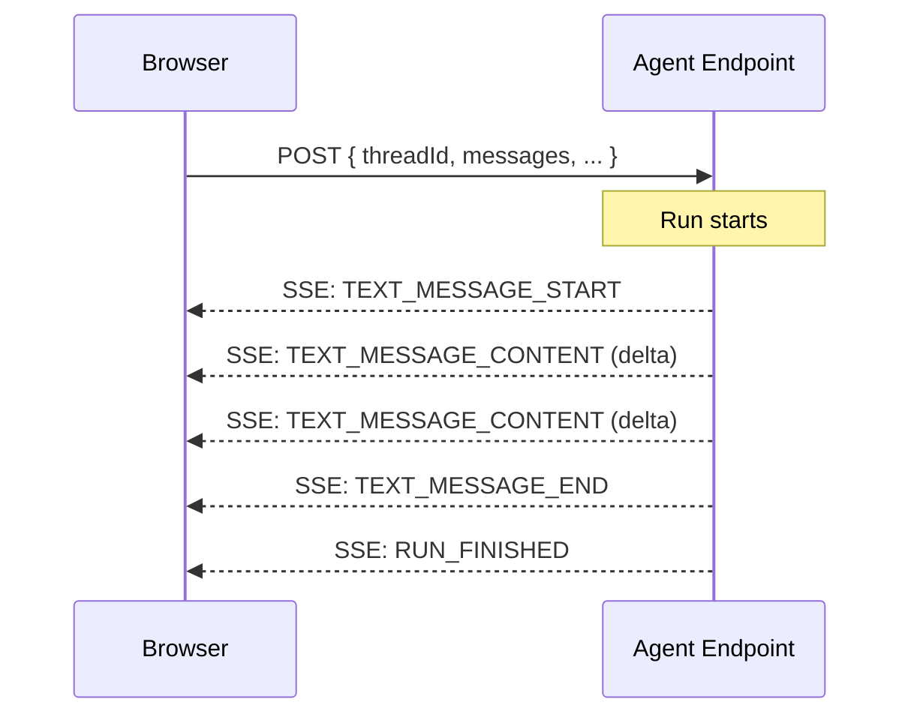

import { PropsTable } from '@/components/ui/props-table';

# AG-UI Protocol

reachat ships a `useAgUi` hook that connects to any
[AG-UI protocol](https://docs.ag-ui.com) compatible agent endpoint. It handles
SSE streaming, session management, and state — returning everything the `<Chat>`
component needs as props.

No extra dependencies are required. The hook implements SSE parsing with the
native Fetch API, so you don't need `@ag-ui/client`, RxJS, or any other AG-UI
packages.

Any framework that implements the AG-UI protocol — LangGraph, Mastra, CrewAI, or
a custom backend — will work out of the box.

## Quick Start

```tsx
import {
  Chat,
  SessionsList,
  SessionGroups,
  SessionMessages,
  SessionMessagePanel,
  SessionMessagesHeader,
  ChatInput,
  NewSessionButton,
  useAgUi
} from 'reachat';

function App() {
  const agui = useAgUi({
    agent: 'https://my-agent.example.com/run'
  });

  return (
    <Chat
      sessions={agui.sessions}
      activeSessionId={agui.activeSessionId}
      isLoading={agui.isLoading}
      onSelectSession={agui.selectSession}
      onDeleteSession={agui.deleteSession}
      onNewSession={agui.createSession}
      onSendMessage={agui.sendMessage}
      onStopMessage={agui.stopMessage}
    >
      <SessionsList>
        <NewSessionButton />
        <SessionGroups />
      </SessionsList>
      <SessionMessagePanel>
        <SessionMessagesHeader />
        <SessionMessages />
        <ChatInput />
      </SessionMessagePanel>
    </Chat>
  );
}
```

## How It Works

1. When the user sends a message, the hook POSTs a `RunAgentInput` payload
   (conversation history, tools, context) to your agent endpoint.
2. The agent responds with a Server-Sent Events (SSE) stream of AG-UI events.
3. The hook parses the stream in real-time, accumulating `TEXT_MESSAGE_CONTENT`
   deltas into the conversation response so the UI updates token-by-token.
4. Sessions and conversations are managed internally — a new session is
   auto-created on first message if none is active.



## Options

<PropsTable name="UseAgUiOptions" typeName="UseAgUiOptions" />

## Return Value

All return values map directly to `<Chat>` component props:

<PropsTable name="UseAgUiReturn" typeName="UseAgUiReturn" />

## Examples

### With Authentication

```tsx
const agui = useAgUi({
  agent: 'https://my-agent.example.com/run',
  headers: {
    Authorization: `Bearer ${token}`
  }
});
```

### With Tool Calls

Define tools using JSON Schema parameters and handle them with the `onToolCall`
callback. The stream pauses until the callback resolves:

```tsx
const agui = useAgUi({
  agent: 'https://my-agent.example.com/run',
  tools: [
    {
      name: 'get_weather',
      description: 'Get the current weather for a location',
      parameters: {
        type: 'object',
        properties: {
          location: { type: 'string', description: 'City name' }
        },
        required: ['location']
      }
    }
  ],
  onToolCall: async toolCall => {
    if (toolCall.toolCallName === 'get_weather') {
      const { location } = JSON.parse(toolCall.args);
      const weather = await fetchWeather(location);
      console.log('Weather result:', weather);
    }
  }
});
```

### With Context

Send additional context to the agent alongside the conversation history:

```tsx
const agui = useAgUi({
  agent: 'https://my-agent.example.com/run',
  context: [
    {
      description: 'Current user profile',
      value: JSON.stringify({ name: 'Jane', role: 'admin' })
    },
    {
      description: 'Application state',
      value: JSON.stringify({ page: '/dashboard' })
    }
  ]
});
```

### With Error Handling

```tsx
const agui = useAgUi({
  agent: 'https://my-agent.example.com/run',
  onError: error => {
    toast.error(`Agent error: ${error.message}`);
  }
});
```

### Pre-populated Sessions

Start with existing conversation history:

```tsx
const agui = useAgUi({
  agent: 'https://my-agent.example.com/run',
  initialSessions: [
    {
      id: 'session-1',
      title: 'Previous chat',
      createdAt: new Date(),
      updatedAt: new Date(),
      conversations: [
        {
          id: 'conv-1',
          question: 'Hello!',
          response: 'Hi there! How can I help?',
          createdAt: new Date()
        }
      ]
    }
  ],
  initialActiveSessionId: 'session-1'
});
```

### Debugging with onEvent

Log every raw AG-UI event for debugging:

```tsx
const agui = useAgUi({
  agent: 'https://my-agent.example.com/run',
  onEvent: event => {
    console.log(`[AG-UI] ${event.type}`, event);
  }
});
```

## Supported AG-UI Events

The hook handles the following AG-UI event types:

| Event                  | Behavior                                    |
| ---------------------- | ------------------------------------------- |
| `TEXT_MESSAGE_CONTENT` | Appends delta to the streaming response     |
| `TEXT_MESSAGE_CHUNK`   | Same as above (convenience event)           |
| `TOOL_CALL_START`      | Begins tracking a tool call                 |
| `TOOL_CALL_ARGS`       | Accumulates streamed tool arguments         |
| `TOOL_CALL_END`        | Invokes `onToolCall` with the complete call |
| `RUN_ERROR`            | Invokes `onError` callback                  |
| `RUN_FINISHED`         | Marks the run as complete                   |

Other events (`RUN_STARTED`, `STEP_STARTED`, `STEP_FINISHED`, `STATE_SNAPSHOT`,
etc.) are passed through to the `onEvent` callback but don't affect the chat
state directly.

## Agent Endpoint Contract

Your agent endpoint must accept a POST request and respond with an SSE stream.

**Request:**

```
POST /your-agent-endpoint
Content-Type: application/json
Accept: text/event-stream

{
  "threadId": "abc123",
  "runId": "run_456",
  "messages": [
    { "id": "msg-1", "role": "user", "content": "Hello" }
  ],
  "tools": [],
  "context": [],
  "state": null,
  "forwardedProps": {}
}
```

**Response (SSE stream):**

```
data: {"type":"RUN_STARTED","threadId":"abc123","runId":"run_456"}

data: {"type":"TEXT_MESSAGE_START","messageId":"resp-1","role":"assistant"}

data: {"type":"TEXT_MESSAGE_CONTENT","messageId":"resp-1","delta":"Hello"}

data: {"type":"TEXT_MESSAGE_CONTENT","messageId":"resp-1","delta":"! How can I help?"}

data: {"type":"TEXT_MESSAGE_END","messageId":"resp-1"}

data: {"type":"RUN_FINISHED","threadId":"abc123","runId":"run_456"}
```

This is the standard [AG-UI protocol](https://docs.ag-ui.com) contract. Any
framework that implements it will work out of the box.

For live demos, visit the [storybook](https://storybook.reachat.dev).
