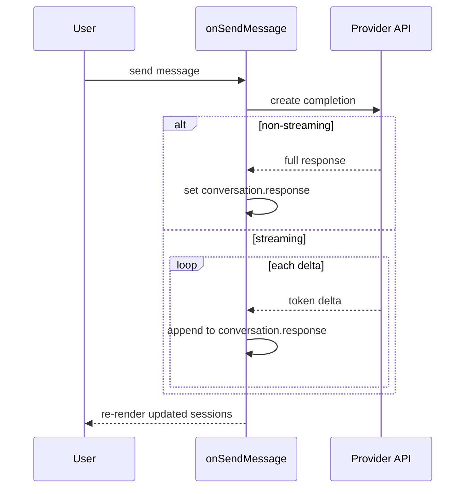

# Providers

Out of the box, reachat is not coupled to any specific provider. It is simply a
set of building blocks that can be used to build chat UIs for any data source —
OpenAI, Anthropic, your own backend, or anything else that returns text.

If your backend speaks the [AG-UI protocol](https://docs.ag-ui.com), skip
manual wiring and use the built-in [`useAgUi`](/docs/examples/ag-ui) hook
instead.

## OpenAI

Below is a minimal end-to-end example that connects reachat to OpenAI's
Chat Completions API. The user supplies their API key in an input field; in
production you should proxy these calls through your own server instead of
calling OpenAI from the browser.

```tsx
import { useState, useCallback, useRef, useEffect } from 'react';
import OpenAI from 'openai';
import { Input } from 'reablocks';
import {
  Chat,
  ChatInput,
  NewSessionButton,
  Session,
  SessionGroups,
  SessionMessagePanel,
  SessionMessages,
  SessionMessagesHeader,
  SessionsList,
} from 'reachat';

export const OpenAIChat = () => {
  const [sessions, setSessions] = useState<Session[]>([]);
  const [activeSessionId, setActiveSessionId] = useState<string | null>(null);
  const [isLoading, setIsLoading] = useState(false);
  const [apiKey, setApiKey] = useState('');

  const openai = useRef<OpenAI | null>(null);

  useEffect(() => {
    if (apiKey) {
      // Demo only — never expose API keys in the browser in production.
      openai.current = new OpenAI({
        apiKey,
        dangerouslyAllowBrowser: true,
      });
    }
  }, [apiKey]);

  const handleNewMessage = useCallback(
    async (message: string) => {
      if (!openai.current) return;

      const sessionId = activeSessionId ?? Date.now().toString();
      setIsLoading(true);

      try {
        const response = await openai.current.chat.completions.create({
          model: 'gpt-4o-mini',
          messages: [{ role: 'user', content: message }],
        });

        const aiResponse =
          response.choices[0]?.message?.content ??
          "Sorry, I couldn't generate a response.";

        setSessions(prev => {
          const idx = prev.findIndex(s => s.id === sessionId);
          const newConversation = {
            id: Date.now().toString(),
            question: message,
            response: aiResponse,
            createdAt: new Date(),
            updatedAt: new Date(),
          };

          if (idx === -1) {
            return [
              ...prev,
              {
                id: sessionId,
                title: message.slice(0, 30),
                createdAt: new Date(),
                updatedAt: new Date(),
                conversations: [newConversation],
              },
            ];
          }

          const next = [...prev];
          next[idx] = {
            ...next[idx],
            updatedAt: new Date(),
            conversations: [...next[idx].conversations, newConversation],
          };
          return next;
        });

        setActiveSessionId(sessionId);
      } catch (error) {
        console.error('Error calling OpenAI API:', error);
      } finally {
        setIsLoading(false);
      }
    },
    [activeSessionId]
  );

  const handleDeleteSession = useCallback((id: string) => {
    setSessions(prev => prev.filter(s => s.id !== id));
    setActiveSessionId(prev => (prev === id ? null : prev));
  }, []);

  return (
    <div className="p-4">
      <Input
        fullWidth
        placeholder="OpenAI API Key"
        value={apiKey}
        onChange={e => setApiKey(e.target.value)}
      />
      <div className="mt-4 h-[600px] rounded-md bg-white p-4 dark:bg-gray-950">
        <Chat
          viewType="console"
          sessions={sessions}
          activeSessionId={activeSessionId ?? undefined}
          isLoading={isLoading}
          disabled={!apiKey}
          onSelectSession={setActiveSessionId}
          onDeleteSession={handleDeleteSession}
          onSendMessage={handleNewMessage}
        >
          <SessionsList>
            <NewSessionButton />
            <SessionGroups />
          </SessionsList>
          <SessionMessagePanel>
            <SessionMessagesHeader />
            <SessionMessages />
            <ChatInput />
          </SessionMessagePanel>
        </Chat>
      </div>
    </div>
  );
};
```

### What's happening

- **`onSendMessage`** receives every user message; we forward it to OpenAI and
  push the response into the active session.
- **`isLoading`** drives the streaming cursor and disables the send button.
- **`disabled`** locks the input until the user provides an API key.

### Request flow

Whether you call the provider once or stream deltas, the shape is the same — `onSendMessage` drives the provider and writes back into the active session:



### Streaming responses

For a streaming experience, replace the single `chat.completions.create` call
with `responses.create({ stream: true })` (or `chat.completions.create({ stream: true })`)
and progressively update the active session's last conversation as deltas arrive.
reachat re-renders incrementally as long as you keep handing it an updated
`sessions` array.

## Other providers

The same pattern applies to any backend:

- **Anthropic** — call `anthropic.messages.create` (or stream) inside
  `onSendMessage` and write the assistant text to `conversation.response`.
- **Vercel AI SDK** — call `streamText`/`generateText` from your route handler
  and proxy chunks back into the session state.
- **Custom backend** — `fetch` to your own endpoint and update sessions as the
  response comes in.

For backends that implement the [AG-UI protocol](https://docs.ag-ui.com), use
the [`useAgUi` hook](/docs/examples/ag-ui) — it handles SSE parsing, tool
calls, and session lifecycle in a single hook call.

For more examples and live demos, visit the
[storybook demos](https://storybook.reachat.dev).
