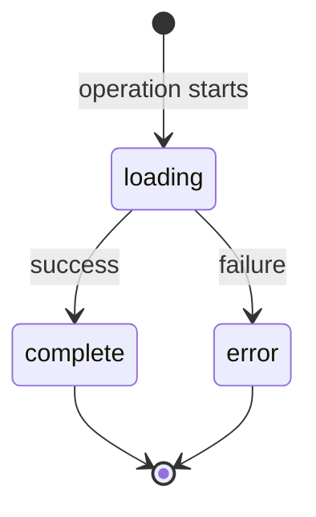

import { StatusExample } from '@/components/examples/status';
import { PropsTable } from '@/components/ui/props-table';

# Message Status
The `MessageStatus` component displays loading, complete, and error states with
optional multi-step progress indicators — useful for tool-call status, agent
step traces, and any long-running operation embedded in a chat response.

## Overview

The `MessageStatus` component provides:
- Visual status indicators (loading, complete, error)
- Animated state transitions
- Multi-step progress display
- Customizable icons
- Support for nested status steps

## Basic Usage

Display a simple status message:

```tsx
import { MessageStatus } from 'reachat';

<MessageStatus
  status="loading"
  text="Processing your request..."
/>
```

## Status States

The component supports three status states:



### Loading State

```tsx
<MessageStatus
  status="loading"
  text="Analyzing data..."
/>
```

### Complete State

```tsx
<MessageStatus
  status="complete"
  text="Analysis complete"
/>
```

### Error State

```tsx
<MessageStatus
  status="error"
  text="Failed to process request"
/>
```

## Multi-Step Status

Display progress across multiple steps:

```tsx
<MessageStatus
  status="loading"
  text="Processing request"
  steps={[
    { id: '1', text: 'Validating input', status: 'complete' },
    { id: '2', text: 'Fetching data', status: 'complete' },
    { id: '3', text: 'Analyzing results', status: 'loading' },
    { id: '4', text: 'Generating report', status: 'loading' }
  ]}
/>
```

## Live Preview

Below is `<MessageStatus>` rendered on its own with multi-step progress:

<StatusExample />

## Using in Conversations

`<MessageStatus>` can be rendered inline inside the messages list — for example,
above the next conversation while a tool call is running:

```tsx
<SessionMessages>
  {(conversations) => (
    <>
      {conversations.map((conversation) => (
        <SessionMessage
          key={conversation.id}
          conversation={conversation}
        />
      ))}
      {isToolRunning && (
        <MessageStatus
          status="loading"
          text="Running tool"
          steps={steps}
        />
      )}
    </>
  )}
</SessionMessages>
```

## Advanced Examples

### Dynamic Status Updates

Update status as operations progress:

```tsx
import { useState, useEffect } from 'react';
import { MessageStatus } from 'reachat';

function AnalysisStatus() {
  const [steps, setSteps] = useState([
    { id: '1', text: 'Initializing', status: 'loading' },
    { id: '2', text: 'Processing data', status: 'loading' },
    { id: '3', text: 'Generating insights', status: 'loading' }
  ]);

  useEffect(() => {
    // Simulate progress
    const timers = [
      setTimeout(() => updateStep('1', 'complete'), 1000),
      setTimeout(() => updateStep('2', 'complete'), 2000),
      setTimeout(() => updateStep('3', 'complete'), 3000)
    ];

    return () => timers.forEach(clearTimeout);
  }, []);

  const updateStep = (id: string, status: string) => {
    setSteps(prev => prev.map(step =>
      step.id === id ? { ...step, status } : step
    ));
  };

  const allComplete = steps.every(s => s.status === 'complete');

  return (
    <MessageStatus
      status={allComplete ? 'complete' : 'loading'}
      text={allComplete ? 'Analysis complete' : 'Running analysis'}
      steps={steps}
    />
  );
}
```

### Error Handling

Display errors with specific step failures:

```tsx
<MessageStatus
  status="error"
  text="Analysis failed"
  steps={[
    { id: '1', text: 'Load dataset', status: 'complete' },
    { id: '2', text: 'Validate schema', status: 'complete' },
    { id: '3', text: 'Run computation', status: 'error' }
  ]}
/>
```

### Custom Icons

Provide custom icons for status states:

```tsx
import { CheckCircle, XCircle, Loader } from 'lucide-react';

<MessageStatus
  status="loading"
  text="Custom status indicator"
  icon={<Loader className="animate-spin" />}
/>
```

### Nested in Markdown

Include status indicators in markdown responses:

```tsx
const conversationWithStatus = {
  id: '1',
  question: 'Run the analysis',
  response: `I'm running the analysis now.

<MessageStatus
  status="loading"
  text="Analyzing data"
  steps={[
    { id: '1', text: 'Loading dataset', status: 'complete' },
    { id: '2', text: 'Computing statistics', status: 'loading' }
  ]}
/>

I'll let you know when it's complete.`,
  createdAt: new Date('2024-01-15T10:00:00Z')
};
```

## Integration with Custom Components

Use with custom markdown components:

```tsx
import { Chat, MessageStatus } from 'reachat';

<Chat
  markdownComponents={{
    MessageStatus: (props) => (
      <MessageStatus
        {...props}
        className="my-custom-status"
      />
    )
  }}
>
  {/* ... */}
</Chat>
```

## Real-World Example

Complete example wiring `<MessageStatus>` to a fetch call. The state machine
keeps a single `status` object that we mutate on every transition:

```tsx
import { useState } from 'react';
import { Chat, MessageStatus, ChatInput } from 'reachat';

type Status = {
  status: 'loading' | 'complete' | 'error';
  text: string;
  steps: { id: string; text: string; status: 'loading' | 'complete' | 'error' }[];
};

function ChatWithStatus() {
  const [status, setStatus] = useState<Status | null>(null);

  const handleSendMessage = async (message: string) => {
    setStatus({
      status: 'loading',
      text: 'Processing request',
      steps: [
        { id: '1', text: 'Sending request', status: 'loading' },
        { id: '2', text: 'Waiting for response', status: 'loading' }
      ]
    });

    try {
      // Mark step 1 complete once the request is in-flight.
      setStatus(prev =>
        prev && {
          ...prev,
          steps: prev.steps.map((s, i) =>
            i === 0 ? { ...s, status: 'complete' } : s
          )
        }
      );

      const response = await fetch('/api/chat', {
        method: 'POST',
        body: JSON.stringify({ message })
      });
      await response.json();

      // Mark all steps complete on success.
      setStatus(prev =>
        prev && {
          status: 'complete',
          text: 'Response received',
          steps: prev.steps.map(s => ({ ...s, status: 'complete' }))
        }
      );
    } catch (error) {
      setStatus(prev =>
        prev && {
          status: 'error',
          text: 'Request failed',
          steps: prev.steps.map(s => ({ ...s, status: 'error' }))
        }
      );
    }
  };

  return (
    <Chat sessions={sessions} onSendMessage={handleSendMessage}>
      <SessionMessagePanel>
        <SessionMessages />
        {status && <MessageStatus {...status} />}
        <ChatInput />
      </SessionMessagePanel>
    </Chat>
  );
}
```

## API Reference

### MessageStatusProps

<PropsTable name="MessageStatus" />

### MessageStatusStep

<PropsTable typeName="MessageStatusStep" />

For more examples and interactive demos, visit the [storybook demos](https://storybook.reachat.dev).
